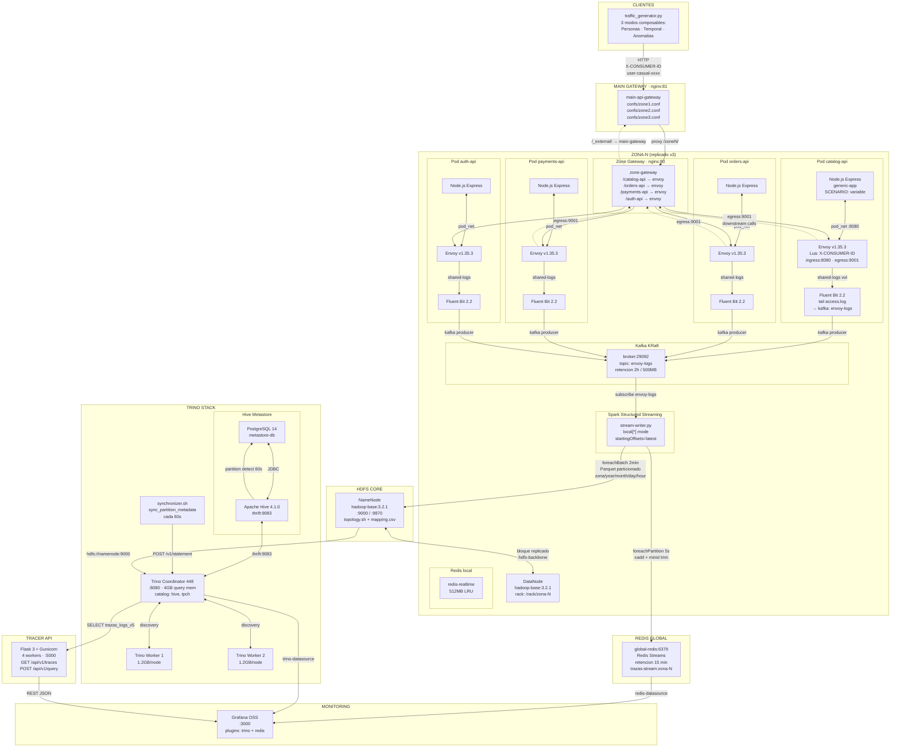
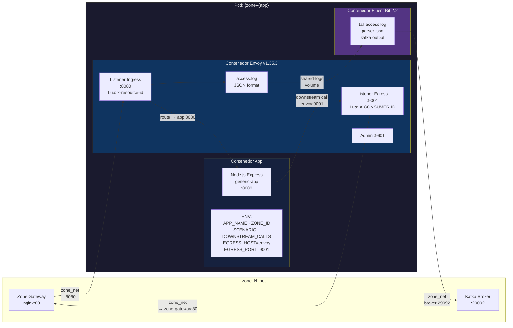
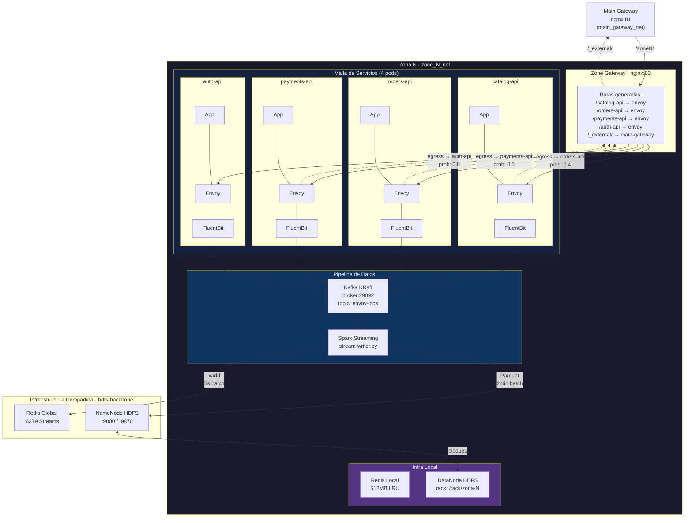
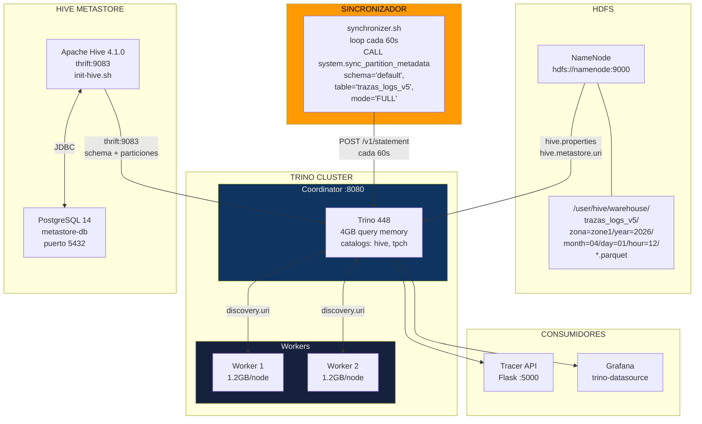
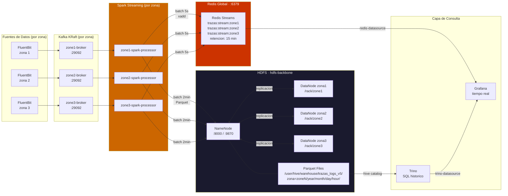

# Diagramas de Arquitectura

## Diagrama General del Sistema



---

## Diagrama: Aplicacion con Sidecar (Pod)

Detalle del patron sidecar implementado para cada aplicacion dentro de una zona.



### Campos del Access Log (JSON)

| Campo | Valor Envoy | Ejemplo |
|-------|------------|---------|
| `id_recurso` | `%REQ(x-resource-id)%` | `catalog-api-1` |
| `id_transaccion` | `%REQ(X-REQUEST-ID)%` | `uuid-generado` |
| `id_consumer` | `%REQ(X-CONSUMER-ID)%` | `user-casual-a1b2c3d4` |
| `ip_transaccion` | `%UPSTREAM_HOST%` | `172.18.0.5:8080` |
| `ip_consumer` | `%DOWNSTREAM_REMOTE_ADDRESS%` | `172.18.0.2:54321` |
| `endpoint` | `%REQ(:PATH)%` | `/catalog-api/products` |
| `status_response` | `%RESPONSE_CODE%` | `200` |
| `time_transaction` | `%DURATION%` | `142` |

---

## Diagrama: Zona Completa

Una zona de disponibilidad con sus 4 apps, infraestructura de datos y conectividad.



### Despliegue de una Zona

```bash
cd zona-deploy/
./deploy-zone.sh zone1 zones/zone1.json
```

Componentes desplegados por `deploy-zone.sh`:

| Paso | Proyecto Docker | Contenedores |
|------|----------------|-------------|
| 1 | `zone1-hdfs` | `zone1-datanode` |
| 2 | `zone1-infra` | `zone1-broker`, `zone1-kafka-consumer` |
| 3 | `zone1-catalog-api` | `zone1-catalog-api-core`, `-envoy`, `-fluentd` |
| 4 | `zone1-orders-api` | `zone1-orders-api-core`, `-envoy`, `-fluentd` |
| 5 | `zone1-payments-api` | `zone1-payments-api-core`, `-envoy`, `-fluentd` |
| 6 | `zone1-auth-api` | `zone1-auth-api-core`, `-envoy`, `-fluentd` |
| 7 | `zone1-gateway` | `zone1-api-gateway` |
| 8 | `zone1-spark` | `zone1-spark-processor` |

**Total por zona: ~17 contenedores**

---

## Diagrama: Trino Stack

Motor de consultas SQL distribuido sobre los datos almacenados en HDFS.



### Consultas de Ejemplo

```sql
-- Trazas por consumidor (personas del traffic generator)
SELECT id_consumer, count(*) as total, avg(time_transaction) as avg_latency
FROM hive.default.trazas_logs_v5
WHERE zona = 'zone1'
GROUP BY id_consumer
ORDER BY total DESC;

-- Cadena de llamadas: ver downstream
SELECT id_transaccion, id_recurso, id_consumer, endpoint, status_response
FROM hive.default.trazas_logs_v5
WHERE id_transaccion = '<uuid>'
ORDER BY date_transaction;

-- Errores por escenario/zona
SELECT zona, status_response, count(*) as total
FROM hive.default.trazas_logs_v5
GROUP BY zona, status_response;
```

---

## Diagrama: Sistema de Almacenamiento

Flujo de datos desde la generacion hasta el almacenamiento persistente y en tiempo real.



### Particionamiento en HDFS

```
/user/hive/warehouse/trazas_logs_v5/
├── zona=zone1/
│   └── year=2026/
│       └── month=04/
│           └── day=01/
│               ├── hour=08/
│               │   ├── part-00000.snappy.parquet
│               │   └── part-00001.snappy.parquet
│               └── hour=09/
│                   └── part-00000.snappy.parquet
├── zona=zone2/
│   └── ...
└── zona=zone3/
    └── ...
```

### Topologia Rack-Aware

```
/rack/zone1  →  zone1-datanode, zone1-spark-processor
/rack/zone2  →  zone2-datanode, zone2-spark-processor
/rack/zone3  →  zone3-datanode, zone3-spark-processor
```

Configurada en `hadoop-config/topology-mapping.csv` y aplicada via `topology.sh` en el NameNode.
